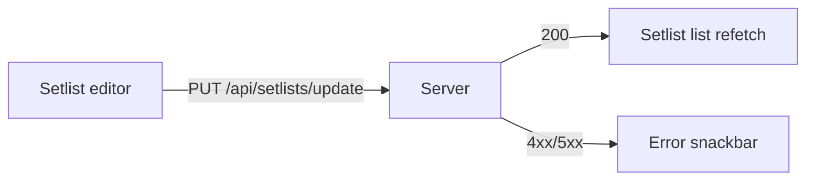

# Writing PR Descriptions

A reviewer should understand _what changed and why_ in under a minute. The diff is the source of truth; the description is the map.

There is no PR template in `.github/` for this repo, so the shape below is the convention.

## Rules

- **First line links the issue:** `Closes #<issue#>` (or `Fixes #` / `Implements #`). This is what auto-closes the issue on merge; the `GH-` prefix in the title does not.
- **Then 1–3 sentences:** problem, change, effect. Don't narrate the diff file by file. Don't restate the title.
- **Tabulate anything you'd otherwise list:** changed behaviours, before/after states, affected pages, new props, endpoints and their `ROUTE_PERMISSIONS` entries.
- **Diagram flows and state transitions** when there are more than three steps (save-setlist flow, folder sharing). Keep them under ~10 nodes, left-to-right (`flowchart LR`, or `direction LR` on state diagrams).
- **Screenshots for any UI change**, desktop and mobile, in a before/after table. The app is used on phones during worship and several components have a separate `*Mobile.tsx` variant, so both need checking.
- **Say how it was verified.** Concrete steps or a checklist a reviewer can replay. Unit tests cover pure logic only and there is no CI check on PRs, so the verification section carries the weight: which pages were opened, at which widths, what was clicked. Type-check (ui and server), lint, unit tests (ui and server), and `yarn build` passing are worth one line.
- **API changes call out access.** A new or changed endpoint states its `requiresAuth` / `allowedAccessTypes` and whether it checks ownership.
- **No file paths or line numbers** in prose. GitHub shows them and line numbers rot on the next push. Exception: a deliberate callout, marked as such:
  > ⚠️ **Reviewer note:** `server/src/policies/permissions.config.ts` changes who can update songs; the rest of the diff is consumers.
- **Flag what was left out on purpose** in one line, so reviewers don't ask (`Not addressed: song filter panel, tracked in #<n>`).
- **No personal data.** No member names, emails, phone numbers, or profile details in the body, screenshots, or test steps. Blur or use dummy accounts.

## Template

Delete sections that don't apply instead of writing "N/A".

```markdown
Closes #<issue#>

<1–3 sentences: problem, change, effect.>

## Changes

| Area                | Before                            | After                             |
| ------------------- | --------------------------------- | --------------------------------- |
| Setlist editor save | Duplicate setlist on double click | Save button disabled while saving |

## Screenshots

|          | Desktop (Before) | Desktop (After) |
| -------- | ---------------- | --------------- |
| Change 1 |                  |                 |

|          | Mobile (Before) | Mobile (After) |
| -------- | --------------- | -------------- |
| Change 1 |                 |                |

## Verification

- [ ] Open `/setlist/add` → add three songs → save → reopen
- [ ] Desktop 1440 and mobile 390
- [ ] `yarn tsc --noEmit` in ui/ and server/, `yarn lint` 0 errors, `yarn build` passes

## Not in this PR

- <deliberate omission, with the follow-up issue number if one exists>
```

## Diagram example

````markdown

````
